# Module 17 Class 1: Introduction to Supervised Machine Learning

## Overview

This week, we will be introducing machine learning. In this unit, students will learn to prepare and transform data, split the data into training and testing sets, create a model and fit the model to the data, scale and normalize data, and then determine the performance of a machine learning model. They'll also learn and use ensemble methods &mdash; combining multiple models to help improve the accuracy, robustness, and performance of the machine learning model. 

In today's class, students will use scikit-learn to prepare and transform data, split the data into training and testing sets, create a model and fit the model to the data, and use linear and logistic regression to make predictions based on test data. 

## Learning Objectives

By the end of class, students will be able to:

* Create a machine learning environment
* Prepare and transform data
* Split data into training and testing sets
* Create a model and fit the model to the data
* Perform linear and logistic regression
* Make predictions based on test data

- - -

## Instructor Notes

* The activities in this class will complement Lessons **17.0.1: Predicting Credit Risk** through **17.4.2: Confusion Matrix in Practice**. The students will benefit from these activities if they‘ve progressed through these lessons, which cover the following concepts, techniques, and tasks:  

  * Creating a machine learning environment
  * Splitting data into training and testing sets 
  * Fitting the model to improve accuracy 
  * Understanding and using linear and logistic regression to make predictions
  * Assessing the accuracy, precision, and sensitivity of the model

* Stress that creating a model, fitting or training the model to the data, and then using the model to make predictions has become the standard pattern that many machine learning libraries use. This common pattern eases experimenting with new algorithms and libraries when exploring machine learning solutions. The students will learn that no single correct algorithm exists for any dataset or problem &mdash; and that experimentation and validation are often preferred. The students will learn to quantify and validate the performance of many models to determine the one that best suits the needs of a given dataset.

* If you have issues with any of today's activities, you may report it [here](http://tiny.cc/BootCampFeedback).

## Instructor Prep

**What is the relevance of machine learning?**

Machine learning is one kind of data analysis that automates model building, allowing us to create systems that can identify patterns, make decisions, and learn without much human intervention. It's an exciting realization of the power of artificial intelligence: as a computer learns from previous computations, it can produce reliable, repeatable results from previous decisions.

Although machine learning has been around for a while, recent years have seen a spike in its popularity. You can hear about it being used in Twitter marketing, in the recommendation systems that Netflix, Hulu, and Amazon use, and even in self-driving cars. The purpose of machine learning is to analyze more data in less time, delivering accurate results every time.

This branch of data analytics will continue growing in various areas: in the financial sector to identify investment opportunities, in government work to detect fraud, and in the advancement of wearable healthcare devices.

## Slides

[Supervised ML Day 1](https://docs.google.com/presentation/d/1ubTOCg1K_Wy2ZbeaAU2daE-0-SeW42ORjgP-BmjKXSw/edit?usp=sharing)

## Student Resources

If students were unable to download today's [activity resources](https://2u-data-curriculum-team.s3.amazonaws.com/data-viz-online-lesson-plans/17-Lessons/17-1-Student_Resources.zip) from Canvas, please share them with the students.

- - - 

## Before Class

### 0. Office Hours

| Activity Time: 0:30       |  Elapsed Time:     -0:30  |
|---------------------------|---------------------------|

<details>
  <summary><strong> 📣 0.1 Instructor Do: Office Hours</strong></summary>

* Before you begin class, hold office hours. Office hours should be driven by students. Encourage students to take full advantage of office hours by reminding them that this is their time to ask questions and get assistance from instructional staff as they learn new concepts.

* Expect that students may ask for the following: 

  * Further review on a particular subject
  * Debugging assistance
  * Help with computer issues
  * Guidance with a particular tool

</details>

- - - 

## During Class 

### 1. Getting Started

| Activity Time:       0:15 |  Elapsed Time:      0:15  |
|---------------------------|---------------------------|

<details>
  <summary><strong>📣 1.1 Instructor Do: Foundation Setting (0:10)</strong></summary>

* Welcome students to class.

* Direct students to post individual questions in the Zoom chat to be addressed by you or your TAs at the end of class.

* Open the slideshow and use slides 1 - 12 to walk through the foundation setting with your class. 

* **Big Picture:** This is an opportunity to zoom out and see the big picture of where they are in the program. Take a moment to mention some real-world examples that show the value of what they’re learning this week.

* **Program Pointers:** Talk through some of the key logistical things that will help students stay on track. This is an opportunity to speak to what students may need when they're at this particular point of the program. 

* **This Week - Supervised Machine Learning:** Talk through the key skills students will be learning this week. The primary focus of the Day 1 activities is to reinforce the basics of supervised machine learning. On Day 2, the activities will dive into how to transform data, scale and normalize data,and use a variety of algorithms to make predictions.

* **This Week's Challenge:** For this week's Challenge, let the students know that they'll be evaluating three machine learning models that use resampling, the `RandomOverSampler` and `SMOTE` oversampling algorithms and the `ClusterCentroids` undersampling algorithm, to determine which model is better at predicting credit risk.

* **Career Connection:** Let students know how they will use the skills covered this week throughout their careers. It's important for them to know the "why." Give examples of when they may be used in work or when you have used those skills in your workplace. 

* **How to Succeed This Week:** Remind your students that they may have moments of frustration this week as they learn something complex. These moments are great for deepening their knowledge. Use the slide material to outline some of the topics that they may find tricky in this module. Consider sharing something about your personal learning journey. It helps students to recognize that everyone starts somewhere and that they are not alone.

* **Today's Objectives:** Now, outline the concepts that will be covered in today's lesson. Remind students that they can find the relevant activity files in the “Getting Ready for Class” page in their course content.  

</details>

<details>
  <summary><strong>🎉  1.2 Everyone Do: Check-In (0:05)</strong></summary>

* Ask the class the following questions and call on students for answers:

    * **Q:** How are you feeling about your progress so far?

    * **A:** We are continuing to build on your skill set by learning and using a new topic &mdash; supervised machine learning. It’s okay to feel overwhelmed as long as you don’t give up.

    * **Q:** How comfortable do you feel with this topic? 

    * **A:** Let's do "fist to five" together. If you are not feeling confident, hold up a fist (0). If you feel very confident, hold up an open hand (5).

</details>


- - -

### 2. Intro to Machine Learning and scikit-learn

| Activity Time:       0:35 |  Elapsed Time:      0:50  |
|---------------------------|---------------------------|

<details>
  <summary><strong> 📣 2.1 Instructor Do: Demystifying Machine Learning (0:10)</strong></summary>

* Welcome the students to the class, and then introduce them to the topic for the next three weeks: machine learning.

* Use slides 13 and 14 to show students where machine learning fits in the scope of the course. 

* Then, use slides 15 - 29 to cover the following points:

  * The definition of a machine learning algorithm is broad. One algorithm might include 2 internal parameters, while another might include 10,000, but the idea remains the same.

  * We can categorize machine learning into supervised learning, unsupervised learning, and reinforcement learning (note that reinforcement learning is outside the scope of this class). Inform the students that this week will focus on supervised learning, the following week will focus on unsupervised learning, and that the third and final week of machine learning will cover neural networks and deep learning &mdash; which are specific architectures for supervised learning.

  * We can further categorize supervised learning into classification and regression algorithms. Explain that classification algorithms are used for discrete labels, while regression algorithms are used for continuous labels.

* Use slides 30 – 34 to discuss clustering as an example of unsupervised learning, which we'll cover in more depth next week.

* Use slides 35 - 37 to cover the model-fit-predict pattern in scikit-learn. Let the students know that every model that we will use follows this pattern.

* Ask the class the following questions and call on students for the answers:

    * **Q:** Where have we used this before?

    * **A:** An overview of supervised learning was provided in Lesson 17.2.1, and an overview of regression and classification was provided in Lesson 17.2.2.

    * **Q:** How does this activity equip us for the Challenge?

    * **A:** We will need to understand the basic concepts of machine learning to help us complete the Challenge.

    * **Q:** What can we do if we don't completely understand this?

    * **A:** We can refer to the lesson plan and reach out to the instructional team for help.

 * Take a moment to address any questions before moving on to the next activity.

</details>

<details>
  <summary><strong> 📣 2.2 Instructor Do: Linear Regression with scikit-learn (0:10)</strong></summary>

* You can use slides 39 - 50 and cover the following:

  * Explain that the best way to warm up to machine learning is to revisit an algorithm that we're already familiar with: linear regression.

  * Explain that linear regression is one of the fundamental algorithms in machine learning. Be sure to note that we often use linear regression as a building block for other machine learning algorithms, such as neural networks and deep learning.

  * Remind them that they covered linear regression in a previous module and that data science uses linear regression to model and predict the relationships between dependent and independent factors.
  
  * **Q:** Ask them what the purpose of using **linear regression** is.

  * **A:** Linear regression tries to model and predict the relationship between a dependent variable and an independent variable. 
  
    * Point out that in machine learning, the independent variable is also referred to as a **feature** or a **factor** 
  
  * **Q:** Ask them what the purpose of using **multiple linear regression** is. 
  
  * **A:** Multiple linear regression tries to predict a dependent variable based on multiple independent variables.

  * Remind the students that linear regression calculates the coefficients for the slope and the intercept to create a linear equation:

    ```python
    y = mx + b
    ```

  * When dealing with multiple features, however, linear regression tries to determine a coefficient for each feature; i.e., linear regression calculates a weighted value for each feature to determine an optimal linear equation.

  * Explain that linear regression is fast! If linear regression can solve a problem, then it may be more efficient and economical than using a more complex model such as deep learning.

    * Point out that many data scientists start with a linear regression model. Then, they move to a more complex model only if their data proves to be truly nonlinear.

* You can use slides 51 - 60 to assist you with this activity.

* Open [Ins_Univariate_Linear_Regression_Sklearn.ipynb](Activities/01-Ins_Linear_Regression/Solved/Ins_Univariate_Linear_Regression_Sklearn.ipynb) in Jupyter Notebook, and then take the students through the code. Make sure to cover the following:

  * Explain that we use a sklearn function named `make_regression` to generate test data.

  * Go through the `make_regression` parameter list and explain that we define 20 samples (rows) with one feature (column) as well as some noise and bias.

  * Use Matplotlib to plot the data, and then show the linear trend. Explain that as `X` increases, `y` increases by a roughly constant rate, as the following image shows:

    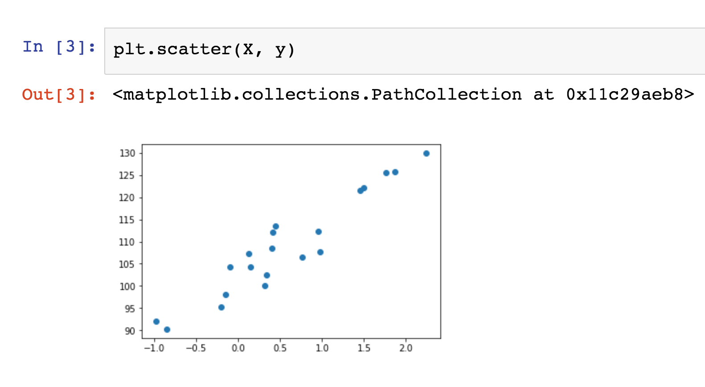

  * Explain that linear data can also have a negative trend. In this case, as the independent value (x) increases, the dependent value (y) decreases.

  * Show the formula for univariate linear regression, and then explain that it’s just finding a line that best fits the data, as the following image shows:

    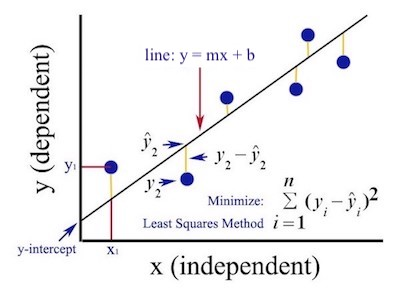

* Use the house price example to illustrate the process of getting new data (a new house on the market) and using linear regression to predict the home price, as the following image shows:

  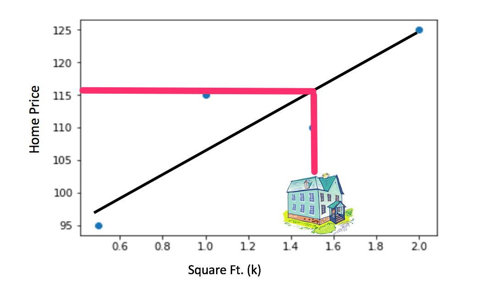

* Briefly discuss nonlinear data by using the examples that the notebook supplies. The following image shows a plot of nonlinear data:

  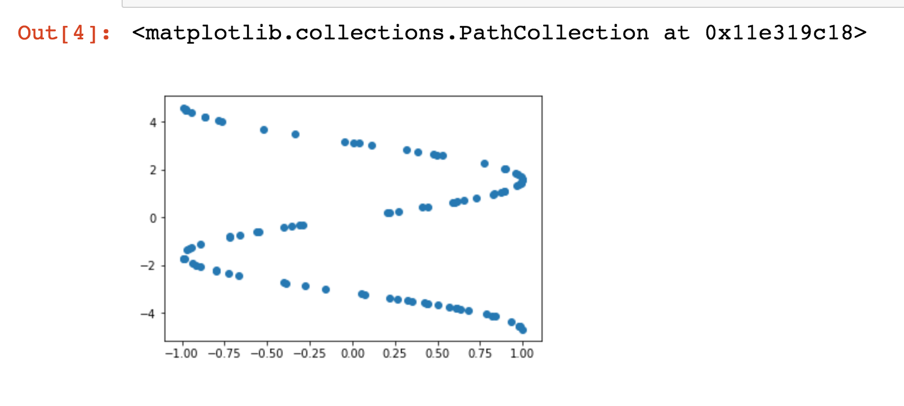

* Review the model-fit-predict pattern and make sure to cover the following:

  * Explain that many popular machine learning libraries follow the model-fit-predict pattern. Take the students through an example using linear regression in sklearn. 

  * First, we'll import `LinearRegression` from sklearn and use it to create an instance of a model.

    ```python
    from sklearn.linear_model import LinearRegression
    model = LinearRegression()
    ```

  * Once we have a model instance, we need to fit the model to the data. This is the training process.

    * Explain that the goal of the training is to find the slope and the intercept that best represent the data (that is, to fit a line to the data).

      ``` python
      model.fit(X, y)
      print(model)
      ````

  * Show the slope and the intercept for the model by using `model.coef_` for the slope and `model.intercept_` for the y-axis intercept, as the following image shows:

    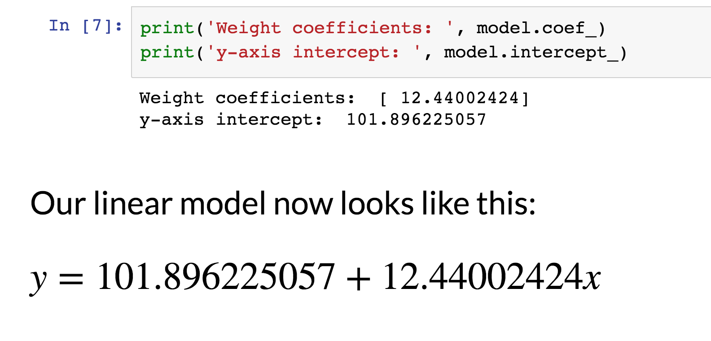

  * Next, we can use the line to make predictions for new inputs because we have a model that can take any value of `X` and calculate a value of `y` that follows the trend of the original data.

  * **Note:** The format for passing values to `model.predict()` is a list of lists, as the following code shows:

    ```python
    y_min_predicted = model.predict([[x_min]])
    y_max_predicted = model.predict([[x_max]])
    ```

  * Compare the first prediction to the original output value. These two values should be very close because the model represents the trend of the original data.

  * Plot the original data against the predicted minimum and maximum values. This will visualize how well the model fits the original data. The following image shows the plot:

    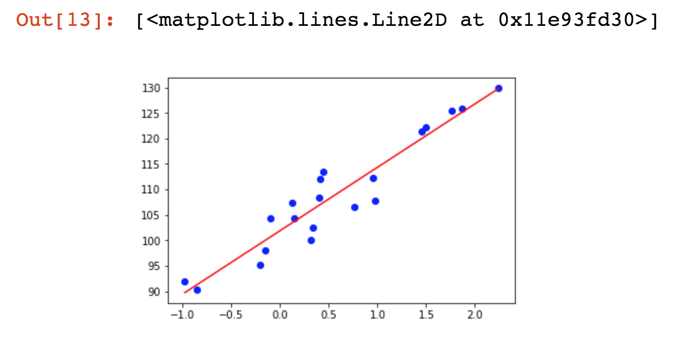

* You can use slides 61 - 69 to assist you with this activity.

* Now, open [Ins_Multiple_Linear_Regression_Sklearn.ipynb](Activities/01-Ins_Linear_Regression/Solved/Ins_Multiple_Linear_Regression_Sklearn.ipynb) in Jupyter Notebook and take the students through the code. Make sure to cover the following:

  * Explain that multiple linear regression is linear regression that uses multiple input features. Use the home price example as an analogy. Linear regression can predict the price of a home depending on one feature: square footage. With multiple linear regression, we can have multiple inputs, such as the number of bedrooms, number of bathrooms, and square footage. The following image shows the formulas:

    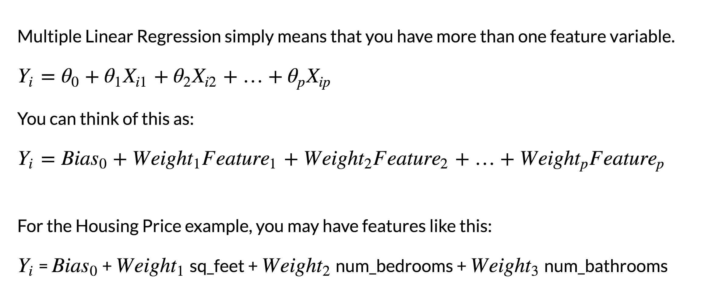

  * Explain that with multiple linear regression, it becomes hard to visualize the linear trends in the data. We need to rely on our regression model to correctly fit a line. Sklearn uses the ordinary least squares method for fitting the line. Luckily for us, the API to the linear model is the same as before! We simply fit our data to our n-dimensional `X` array, as the following image shows:

      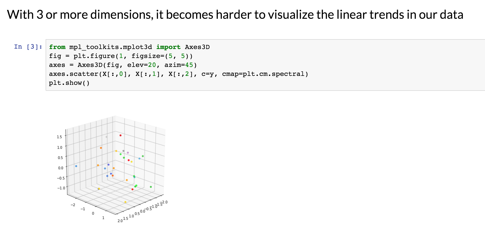

* Finally, explain residuals.

  * Sometimes, a linear regression model may not be an appropriate or decent fit for the data. In order to determine if the linear regression model is a decent fit of the data, we need to examine the residuals. 

  * **Residuals** are the differences between the true values of `y` and the predicted values of `y`.
  
  * When we plot residuals, if there is equal distribution above and below the *x*-axis, then the linear model provides a decent fit to the data. The residual plot also gives us a visual sense of the variance of the residuals, as the following image shows:

    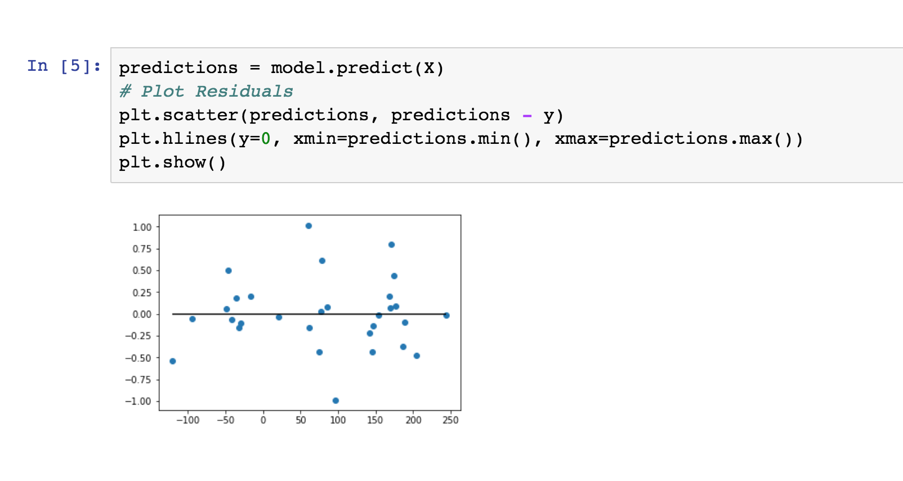

* Send out the [01-Ins_Linear_Regression/Solved](Activities/01-Ins_Linear_Regression/Solved/) folder for students to refer to later.

* Ask the class the following questions and call on students for the answers:

    * **Q:** Where have we used this before?

    * **A:** Linear regression was covered in Lesson 17.2.3.

    * **Q:** How does this activity equip us for the Challenge?

    * **A:** We will need to understand regression to help us complete the Challenge.

    * **Q:** What can we do if we don't completely understand this?

    * **A:** We can refer to the lesson plan and reach out to the instructional team for help.

 * Take a moment to address any questions before moving on to the student activity.


</details>

<details>
  <summary><strong>🎉 2.3 Everyone Do: Linear Regression (0:15)</strong></summary>

* In this activity, the students will calculate a univariate regression and a multivariate regression on California housing data.

* Make sure the students can download and open the [instructions](Activities/02-Evr_Linear_Regression/README.md) and [Linear_Regression_starter.ipynb](Activities/02-Evr_Linear_Regression/Unsolved/Linear_Regression_starter.ipynb) file from the AWS link.

* Go over the instructions with the students and check for understanding.

* Have everyone open the [Linear_Regression_starter.ipynb](Activities/02-Evr_Linear_Regression/Unsolved/Linear_Regression_starter.ipynb) file, and ask for volunteers to help you write the code to complete the solution. 

* If there are no volunteers, open the solved [Linear_Regression.ipynb](Activities/02-Evr_Linear_Regression/Solved/Linear_Regression.ipynb) file in Jupyter Notebook and go over the following: 

* **To determine univariate regression:**

  * Show how to assign the data and target to the `X` and `y` variables as follows:

    * Explain that it's not necessary to use `X` and `y` for the names, but doing so provides a consistent set of variable names for our models.

    * Explain that we have to call `reshape(-1, 1)` to format the array for sklearn. This is necessary only for a one-dimensional array, as the following code shows:

      ```python
      med_inc = np.array([row[0] for row in X]).reshape(-1, 1)
      ```

    * Then, we can create the scatter plot `plt.scatter(med_inc, y)`.
    
    * Next, we can create the model and fit the model to the data. 
    
      ```python
      model = LinearRegression()
      model.fit(med_inc, y)
      ```
    
    * Then, we transform the `x_min` and `x_max` values to fit the list-of-lists format that `model.predict()` requires, as the following code shows:

      ```python
      x_min = np.array([[X.min()]])
      x_max = np.array([[X.max()]])
      print(f"Min X Value: {x_min}")
      print(f"Max X Value: {x_max}")
      ```

    * Next, we can calculate the `y_min` and `y_max` by using `model.predict()`.
    
    ``python
       y_min = model.predict(x_min)
       y_max = model.predict(x_max)
      ```
    * Now, we can plot the model-fit line.
    
      ```python
       plt.scatter(med_inc, y, c='blue')
       plt.plot([x_min[0], x_max[0]], [y_min[0], y_max[0]], c='red')
      ```

  * Plot `x` and `y` to show the linear trend in the data. 

    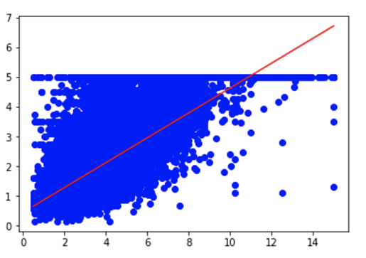

  * Point out how well the line fits the model.

  * **Q:** Ask the students what it might indicate if the line didn't appear to match the data well. Explain that it might indicate that the model wasn't a good fit or that errors existed in the code.

* **To determine multivariate regression:**

  * Show that our API is the same (that is, we still use the model-fit-predict interface with sklearn). Only the dimensionality of the data changes. Point out that we don't have to call `reshape` for our `X` data because it already exists in the format that sklearn expects. We have to reshape only one-dimensional input vectors.

  * First, we create training and testing data. 

    ```python
    from sklearn.model_selection import train_test_split
    X_train, X_test, y_train, y_test = train_test_split(X, y, random_state=42)
    ```
  
  * Next, we create the model like before; we then fit the model to the training data and calculate the *R*<sup>2</sup> score for the training and the testing data separately.

    ```python
    model.fit(X_train, y_train)
    training_score = model.score(X_train, y_train)
    testing_score = model.score(X_test, y_test)
    print(f"Training Score: {training_score}")
    print(f"Testing Score: {testing_score}")
    ```

  * Finally, we show the residual plot for this model by using both training and testing data. This plot has outliers, which might indicate that our model won't perform as expected. It's hard to say without testing with more data points.

    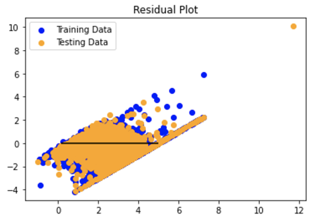

  * Point out that with multivariate regression, it's harder to visually tell if the model offers a good fit. It's better to quantify our models, which the next activity covers.

* Reassure the students that even though this activity was difficult, the sklearn and TensorFlow libraries share a common API. So, gaining proficiency with the model-fit-predict steps will ease switching to other machine learning models later. They'll get plenty of practice with this today! 

* Send out the [02-Evr_Linear_Regression/Solved/Linear_Regression.ipynb](Activities/02-Evr_Linear_Regression/Solved/Linear_Regression.ipynb) file for students to refer to later.

* Answer any questions before proceeding to the next activity.

</details>


- - - 

### 3. Metrics to Quantify Machine Learning Models

| Activity Time:       0:30 |  Elapsed Time:      1:20  |
|---------------------------|---------------------------|

<details>
  <summary><strong> 📣 3.1 Instructor Do: Quantifying Regression (0:10) </strong></summary>

* You can use slides 71 - 77 to assist you with this activity.

* In this demonstration, you'll compare two popular metrics used to quantify machine learning models, then you’ll cover the importance of validation by splitting the data into training and testing sets.

* Open [Ins_Quantifying_Regression.ipynb](Activities/03-Ins_Quantifying_Regression/Solved/Ins_Quantifying_Regression.ipynb) in Jupyter Notebook.

* **Demonstrate quantification:**

  * Use slide 73 while explaining that judging the strength of a model requires more than a visual confirmation. We must quantify the model’s strength. People commonly use two quantification scores: *R* squared (*R*<sup>2</sup>) and mean squared error (MSE).

  * Mention that sklearn supplies functions to calculate these metrics.

  * Switch to [Ins_Quantifying_Regression.ipynb](Activities/03-Ins_Quantifying_Regression/Solved/Ins_Quantifying_Regression.ipynb), and then demonstrate how to use `sklearn.metrics` to calculate the MSE and *R*<sup>2</sup> scores.

  * Point out that a good MSE score is close to zero, while a good *R*<sup>2</sup> score is close to 1.

  * Explain that *R*<sup>2</sup> is the default score for most of the sklearn models. We can calculate it directly from the model by using the `model.score()` method.

* **Demonstrate validation:**

  * You can use slides 74 - 76 for this part of the activity.

  * Point out that to understand how the model will perform on new data, we split the data into training and testing datasets. We fit (train) the model by using the training data, and we score (validate) the model by using the testing data. This gives us an unbiased measure of the effectiveness of the model.

  * Point out that this training-testing splitting is so common that sklearn supplies a mechanism for doing so. Use [Ins_Quantifying_Regression.ipynb](Activities/03-Ins_Quantifying_Regression/Solved/Ins_Quantifying_Regression.ipynb) to demonstrate to the students how to use the `train_test_split()` function to split the data into training and testing data.

  * Next, show them that after we split the data, we train the model and then validate. 

* Send out the [03-Ins_Quantifying_Regression/Solved/Ins_Quantifying_Regression.ipynb](Activities/03-Ins_Quantifying_Regression/Solved/Ins_Quantifying_Regression.ipynb) file for students to refer to later.

* Ask the class the following questions and call on students for the answers:

    * **Q:** Where have we used this before?

    * **A:** Splitting the data into training and testing sets was introduced in Lesson 17.3.1.

    * **Q:** How does this activity equip us for the Challenge?

    * **A:** Splitting the data into training and testing sets will need to be done in order to complete the Challenge.

    * **Q:** What can we do if we don't completely understand this?

    * **A:** We can refer to the lesson plan and reach out to the instructional team for help.

 * Take a moment to address any questions before moving on to the student activity.


</details>

<details>
  <summary><strong>🎉 3.2 Everyone Do: Brains! (0:20) </strong></summary>

* In this activity, the students will calculate a regression line to predict head size versus brain weight.

* Make sure the students can download and open the [instructions](Activities/04-Evr_Brains//README.md), the [brain.csv](Activities/04-Evr_Brains//Resources/brain.csv), and the [Evr_Brains_starter.ipynb](Activities/04-Evr_Brains/Unsolved/Brains_starter.ipynb) files from the AWS link.

* Go over the instructions with the students and check for understanding.

* Have everyone open the [Brains_starter.ipynb](Activities/04-Evr_Brains/Unsolved/Brains_starter.ipynb) file and run the starter code to load and reshape the data, then ask them to create the scatter plot to find out if a linear trend exits. 

* If any students are stuck on creating a scatter plot, remind them that they pass the `X` and `y` in the `plt.scatter()` function. 

* Next, ask for volunteers to split the data into training and testing datasets, create the model, and fit the model to the training data. 

* If there are no volunteers, open the solved [Brains.ipynb](Activities/04-Evr_Brains/Solved/Brains.ipynb) file in Jupyter Notebook and go over the following: 

  * We use the Sklearn `train_test_split()` function to split the data into training and testing data.

    ```python
    X_train, X_test, y_train, y_test = train_test_split(X, y, random_state=42)
    ```
  * Then, we use `model = LinearRegression()` to create an instance of the model.

  * Next, we fit the model by using `model.fit(X_train, y_train)`. 

  * Remind the students that this standard process before we quantify our linear regression model. 

* Next, walk the students through how to calculate the MSE and *R*<sup>2</sup> scores. 

  * **Q:** Ask the students what the first step is in quantifying our model.

  * **A:** We predict a value with our model using `predicted = model.predict(X_test)`.

  * **Q:** Ask the students what the next step is after we’ve predicted a value.

  * **A:** We create the MSE and *R*<sup>2</sup> score. 

    ```python
    mse = mean_squared_error(y_test, predicted)
    r2 = r2_score(y_test, predicted)
    print(f"mean squared error (MSE): {mse}")
    print(f"R-squared (R2 ): {r2}")
    # Overall Score for the model
    model.score(X_test, y_test)

    ````

* Note that `r2_score` and `model.score` produce the same *R*<sup>2</sup> score.

* Ask the students if the MSE and *R*<sup>2</sup> scores are good, and ask why. 

  * Let them know that the MSE score is large because MSE doesn't have an upper bound. Optionally, Slack out the formula for [MSE](https://en.wikipedia.org/wiki/Mean_squared_error).

* Highlight the fact that the model should always perform better on the training dataset than on the testing dataset. This is because the model was trained on the training data. Intuitively, we expect the model to perform better on data that it's encountered before than on data that it hasn't.

* Send out the [04-Evr_Brains/Solved/Brains.ipynb](Activities/04-Evr_Brains/Solved/Brains.ipynb) file for students to refer to later.

* Answer any questions before proceeding to the next activity.


</details>


- - - 

### 4. Logistic Regression

| Activity Time:       0:35 |  Elapsed Time:       1:55 |
|---------------------------|---------------------------|

<details>
  <summary><strong> 📣 4.1 Instructor Do: Logistic Regression (0:15)</strong></summary>

* You can use slides 79 - 87 to assist you with this activity, and highlight the following points on slides 80&ndash;82:

  * **Logistic regression** is a statistical method for predicting binary outcomes from data. With linear regression, our linear model might provide a numerical output, such as age. With logistic regression, we can then translate each numerical value for age into a probability from 0 to 1. We can then label this discrete output as "young" versus "old." The following image illustrates the equations and the line plots for both types of regression:

    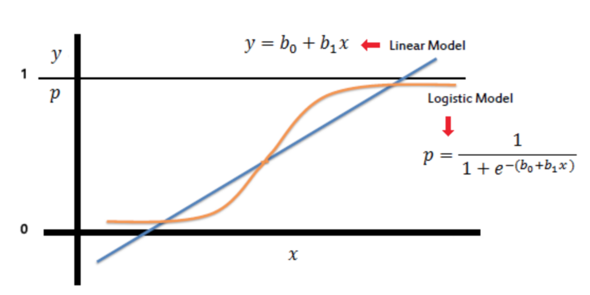

  * We calculate the logistic regression by applying an activation function as the final step to our linear model. This transforms a numerical range to a bounded probability from 0 to 1.

  * We can use logistic regression to predict which category or class a new data point should belong to. For example, assume that we have two classes of data: a red class and a blue class. The data points in each class cluster together on a plot. Applying logistic regression gives us a line that separates the two classes on the plot. Now, we can predict which class a new data point should belong to &mdash; according to which side of the line it falls on. The following three images illustrate this process:

    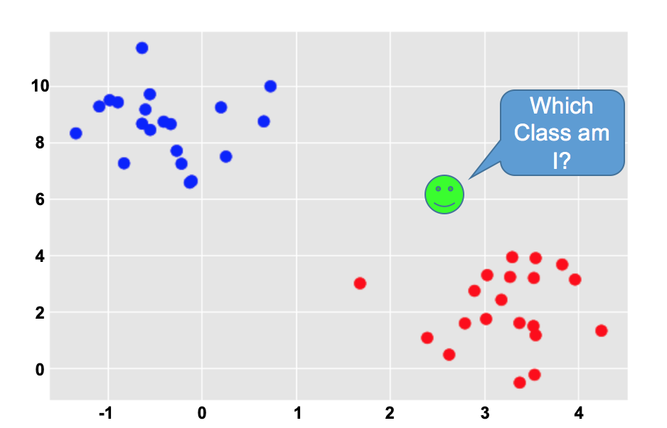
    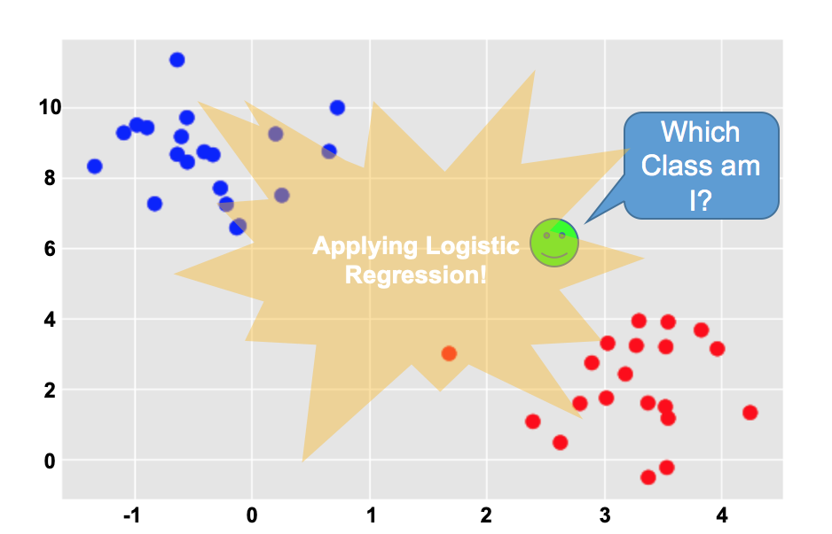
    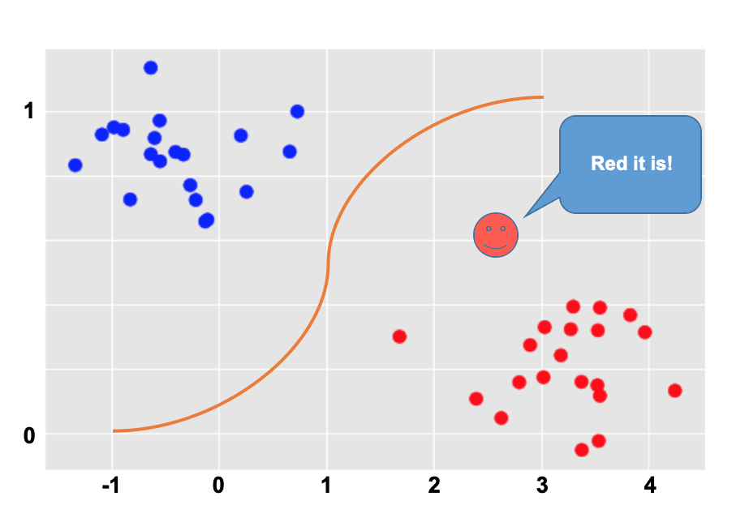

* Open the [05-Ins_Logistic_Regression/Solved/Ins_Logistic_Regression.ipynb](Activities/05-Ins_Logistic_Regression/Solved/Ins_Logistic_Regression.ipynb) file in Jupyter Notebook, and then go through the scikit-learn implementation for logistic regression, as follows:

  * Explain that we can use the `make_blobs` function to generate two groups or classes of data. We can then apply logistic regression to determine if new data points belong to the purple group or the yellow group. The following image shows a plot of both classes of data that we generated:

    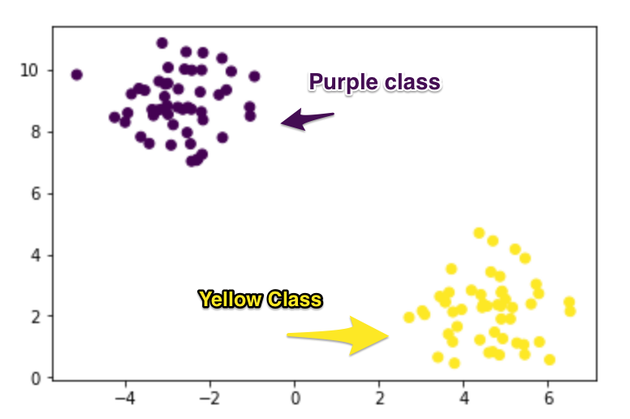

  * First, we create our model by using the `LogisticRegression` class from sklearn, as the following image shows:

    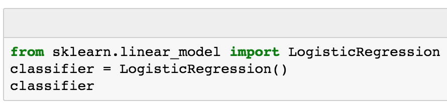

  * Next, we fit the model by using our training data, as the following image shows:

    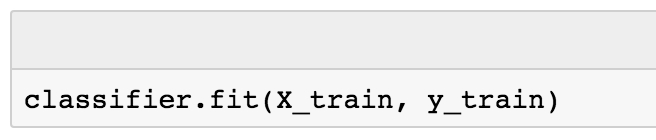

  * Then, we validate the model by using the test data, as the following image shows:

    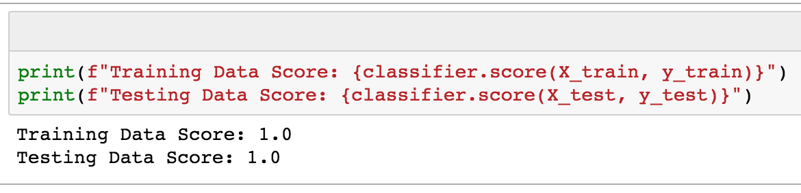

  * Finally, we can make predictions. First, we generate a new data point, as the following image shows:

    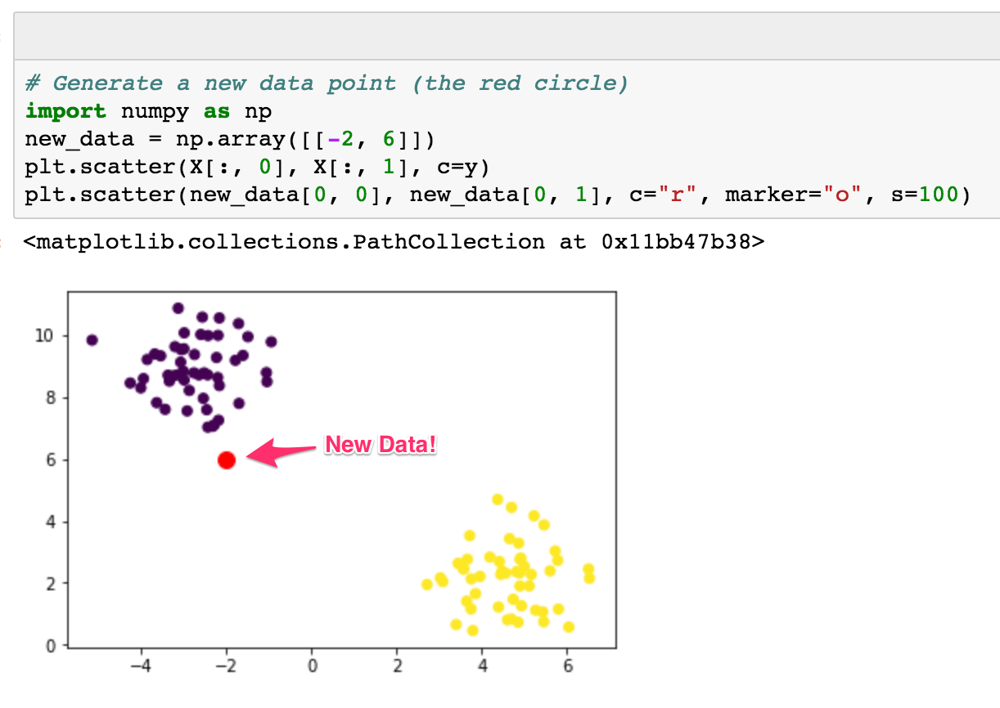

    * Then, we predict the class of the new data point, as the following image shows:

    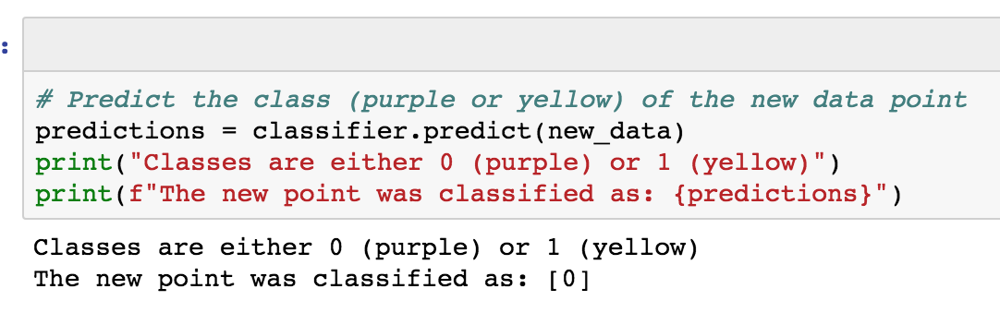

* Send out the [05-Ins_Logistic_Regression/Solved/Ins_Logistic_Regression.ipynb](Activities/05-Ins_Logistic_Regression/Solved/Ins_Logistic_Regression.ipynb) folder for students to refer to later.

* Ask the class the following questions and call on students for the answers:

    * **Q:** Where have we used this before?

    * **A:** Logistic regression was covered in Lessons 17.3.1 - 17.3.3.

    * **Q:** How does this activity equip us for the Challenge?

    * **A:** We will need to understand logistic regression to help us complete the Challenge.

    * **Q:** What can we do if we don't completely understand this?

    * **A:** We can refer to the lesson plan and reach out to the instructional team for help.

 * Take a moment to address any questions before moving on to the student activity.

</details>

<details>
  <summary><strong> ✏️ 4.2 Students Do: Counterfeit Catcher (0:15)</strong></summary>

* You can use slides 88 - 91 to assist you with this activity.

* In this activity, the students will apply logistic regression to predict whether a particular bank note is counterfeit or legitimate by using computed features from digitized images.

* Make sure the students can download and open the [instructions](Activities/06-Stu_Counterfeit_Catcher/README.md) and the [Counterfeit-Detection_starter.ipynb](Activities/06-Stu_Counterfeit_Catcher/Unsolved/Counterfeit-Detection_starter.ipynb) file from the AWS link.

* Go over the instructions with the students and answer any questions before breaking the students out in groups. 

* Divide students into groups of 3-5. They should work on the solution by themselves, but they can talk to others in their group to get tips.

* Let students know that they may be asked to share and walk through their work at the end of the activity.

</details>

<details>
  <summary><strong> ⭐ 4.3 Review: Counterfeit Catcher (0:05)</strong></summary>

* Once time is up, ask for volunteers to walk through their solution. Remind them that it is perfectly alright if they didn't finish the activity. 

* To encourage participation, you can open the [Counterfeit-Detection_starter.ipynb](Activities/06-Stu_Counterfeit_Catcher/Unsolved/Counterfeit-Detection_starter.ipynb) file and ask the students to help you complete each part.

* If there are no volunteers, open up the solved [Counterfeit-Detection.ipynb](Activities/06-Stu_Counterfeit_Catcher/Solved/Counterfeit-Detection.ipynb) file and highlight the following:

  * Remind the students that we use logistic regression to predict categories or labels.

  * First, we read in the CSV file and rename the columns using `names=['variance','skewness','curtosis', 'entropy', 'class']`. 

  * Point out that the last column, `class`, will be used to predict the `authentic (0)` or `counterfeit (1)` label when we perform logistic regression.

  * Next, we assign the data to `X` and `y` to reshape the data so `X` contains all the columns except `class` and `y` contains only the `class` column. 

  * After we split our data into training and testing datasets, we create the logistic regression model. 

  * Then, we train our model with the training data and validate the model with the testing data.

    ```python
    # Train the model.
    classifier.fit(X_train, y_train)
    # Validate the model. 
    print(f"Training Data Score: {classifier.score(X_train, y_train)}")
    print(f"Testing Data Score: {classifier.score(X_test, y_test)}")
    ```
  * Finally, we make predictions based on the testing data. 

  * Show the prediction results for at least 10 testing-data samples. We get output labels of `0` or `1`, as the following image shows:

    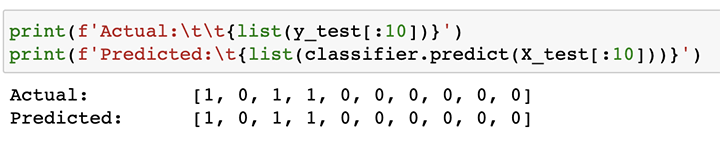

* Send out the [06-Stu_Counterfeit_Catcher/Solved/Counterfeit-Detection.ipynb](Activities/06-Stu_Counterfeit_Catcher/Solved/Counterfeit-Detection.ipynb) file for students to refer to later.

* Answer any questions before ending class.

</details>


- - - 

### 5. Ending Class 

| Activity Time:       0:05 |  Elapsed Time:      2:00  |
|---------------------------|---------------------------|

<details>
  <summary><strong>📣  5.1 Instructor Do: Review </strong></summary>

* Before ending class, review the skills that were covered today and mention where in the module these skills are used: 
  * Overviews of supervised learning, regression was provided in **Lesson 17.2.1**, and an overview of classification was provided in and **Lesson 17.2.2**.
  * Linear regression was covered in **Lesson 17.2.3**.
  * Logistic regression was covered in **Lessons 17.2.3 - 17.3.3**.


* Answer any questions the students may have.

</details>


---

© 2021 Trilogy Education Services, LLC, a 2U, Inc. brand.  Confidential and Proprietary.  All Rights Reserved.