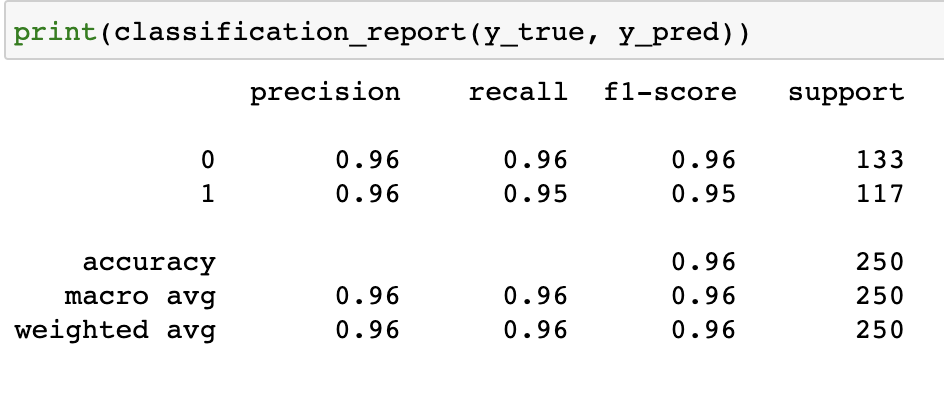
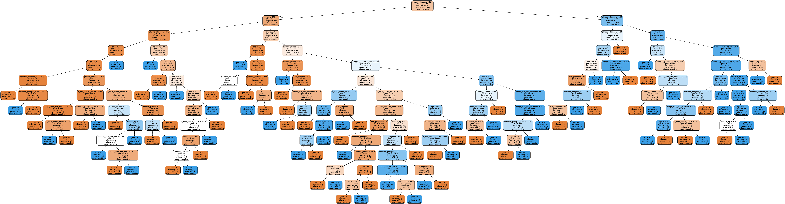
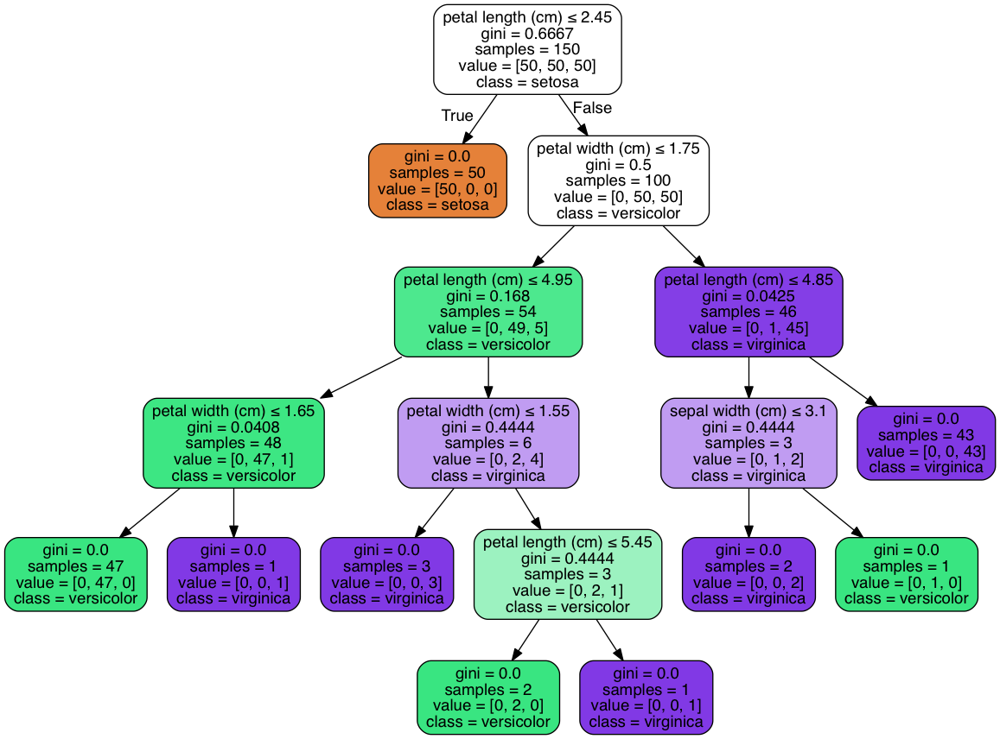

# Module 17 Class 2: Confusion Matrices, Decision Trees, and Ensemble Learning

## Overview

Before class, walk through this week's Challenge assignment in office hours; then, in class, the students will pick up where they left off on Day 1 and determine the performance of machine learning models by using a confusion matrix. Then, they'll scale and normalize data across columns to avoid bias and use decision trees to make predictions. Finally, they’ll learn and use ensemble machine learning methods &mdash; combining multiple models to help improve the accuracy, robustness, and performance of the model.


## Learning Objectives

By the end of class, students will be able to:

* Quantify and evaluate classification models by using confusion matrices
* Interpret confusion matrices and accuracy measures 
* Use decision trees and random forests to aid the feature-selection process
* Apply bagging and boosting methods to create and use ensemble algorithms

- - -

## Instructor Notes

The activities in this class will complement Lessons **17.4.1: Assess Accuracy, Precision, and Sensitivity** through **17.10.3: Combination Sampling With SMOTEENN**. The students will benefit from these activities if they‘ve progressed through these lessons, which cover the following concepts, techniques, and tasks:  

  * Understanding, applying, and interpreting a confusion matrix 
  * Understanding and applying support vector machines
  * Transforming categorical data to numerical data
  * Scaling and normalizing data 
  * Understanding decision trees
  * Applying a decision tree classifier model
  * Understanding ensemble learning methods
  * Applying a random forest classifier model

* If you have issues with any of today's activities, you may report it [here](http://tiny.cc/BootCampFeedback).

## Slides

[Supervised ML Day 2 slideshow](https://docs.google.com/presentation/d/1ovy17kvMVyUXCPo9ExDwmSDGJXhBGZ_iTwmvAp4udZ0/edit?usp=sharing)

## Student Resources

If students were unable to download today's [activity resources](https://2u-data-curriculum-team.s3.amazonaws.com/data-viz-online-lesson-plans/17-Lessons/17-2-Student_Resources.zip) from Canvas, please share them with the students.

- - - 

## Before Class

### 0. Office Hours

| Activity Time: 0:30       |  Elapsed Time:     -0:30  |
|---------------------------|---------------------------|

<details>
  <summary><strong>📣 Instructor Do: Challenge Instruction Walkthrough</strong></summary>

Let the students know that the first few minutes of Office Hours will include a walkthrough of the Challenge requirements and rubric, as well as helpful tips they need in order to be successful.

Open the Challenge in Canvas and go through the high-level instructions and requirements with your class. Be sure to check for understanding.

Open the Rubric in Canvas and go through the Mastery column with your class, and show how it maps back to the requirements for each deliverable. Be sure to check for understanding.

Let them know that this Challenge has **four deliverables**. For the first three, they'll implement machine learning models using resampling and ensemble methods to address class imbalance and evaluate the performance of different machine learning models. For the last deliverable, they'll evaluate the performance of these models in a written analysis, and they’ll make a recommendation on whether any of the models should be used to predict credit risk.

The first deliverable, **Deliverable 1: Use Resampling Models to Predict Credit Risk**, requires the learners use resampling to evaluate three machine learning models to determine which is best at predicting credit risk. 

To complete this deliverable, they'll use the oversampling `RandomOverSampler` and `SMOTE` algorithms and then the undersampling `ClusterCentroids` algorithm.  For each algorithm, they'll resample the dataset, view the count of the target classes, train a logistic regression classifier, calculate the balanced accuracy score, generate a confusion matrix, and generate a classification report.

* We have provided the [credit risk resampling starter code](../../../01-Assignments/17-Supervised-Learning/Challenge/Resources/credit_risk_resampling_starter_code.ipynb) to assist the students with instructions on how to complete this deliverable. 

* Before they use the models, they'll have to create their training and target variables. Once they complete these steps, they can do the following for each machine learning algorithm: start by using the `LogisticRegression` classifier to make predictions and evaluate each model’s performance; then, calculate the accuracy score of the model, generate a confusion matrix, and print out the imbalanced classification report.

For the second deliverable, **Deliverable 2: Use the SMOTEENN Algorithm to Predict Credit Risks**, they'll use a combinatorial approach of over- and undersampling with the `SMOTEENN` algorithm to determine if the results are better at predicting credit risk than the resampling algorithms used in Deliverable 1. 

* There are instructions in the [credit risk resampling starter code](../../../01-Assignments/17-Supervised-Learning/Challenge/Resources/credit_risk_resampling_starter_code.ipynb) to assist the students with completing this deliverable.

* Using the same training and target variables, they'll perform the same steps as they did in Deliverable 1. 

For the third deliverable, **Deliverable 3: Use Ensemble Classifiers to Predict Credit Risk**, they'll train and compare two different ensemble classifiers, `BalancedRandomForestClassifier` and `EasyEnsembleClassifier`, to predict credit risk and evaluate each model.

* The students haven't been introduced to these models, but they are similar to the ones used in this module and Deliverables 1 and 2. 

* To assist the students, we have provided the [credit risk ensemble starter code](../../../01-Assignments/17-Supervised-Learning/Challenge/Resources/credit_risk_ensemble_starter_code.ipynb), which has step-by-step instructions and links to documentation with examples.

* To complete this deliverable, they'll have to create their training and target variables, and then for each machine learning algorithm, they'll use the `LogisticRegression` classifier to make predictions and evaluate each model’s performance. Then, they’ll calculate the accuracy score of the model, generate a confusion matrix, and print out the imbalanced classification report. 

* For the `BalancedRandomForestClassifier` algorithm, they'll also need to print the feature importance, sorted in descending order (from most to least important feature), along with the feature score. 

For **Deliverable 4: Written Report on the Credit Risk Analysis**, the students will be writing a report in the repository README.md file based on the performance of all the machine learning models.

In the **Results** section, using a bulleted list, the students will describe the results of the balanced accuracy, precision, and recall scores of all six machine learning models. They will need to use images of the results to support their conclusions.

In the **Summary** section, the students need to summarize the results of the machine learning models and recommend a model to use, if any. If they do not recommend any of the models, they'll need to justify their reasoning.

Encourage your class to begin the Challenge as soon as possible, if they haven’t already, and to use the Learning Assistants channel and the remainder of Office Hours with their instructional team for help as they progress through their work. If they feel like they need context to understand documentation or instructions throughout the week, this is where they can get it.

Open the floor to discussion and be sure to answer any questions they may have about the Challenge requirements before moving on to other areas of interest.

</details>

<details>
  <summary><strong>📣  Instructor Do: Office Hours</strong></summary>

For the remaining time, remind the students that this is their time to ask questions and get assistance from their instructional staff as they’re learning new concepts and working on the Challenge assignment.

Expect that students may ask for assistance with the following: 

* Challenge assignment 
* Further review on a particular subject
* Debugging assistance
* Help with computer issues
* Guidance with a particular tool

</details>


- - - 

## During Class 

### 1. Getting Started

| Activity Time:       0:10 |  Elapsed Time:      0:10  |
|---------------------------|---------------------------|

<details>
  <summary><strong>📣 1.1 Instructor Do: Foundation Setting (0:05)</strong></summary>

* Welcome students to class.

* Direct students to post individual questions in the Zoom chat to be addressed by you and your TAs at the end of class.

* Open the slideshow and use slides 1-6 to walk through the foundation setting with your class.

* **This Week - Supervised Machine Learning:** Talk through the key skills that students will learn this week, and let them know that they are building on their knowledge of machine learning and statistical analysis.

* **Today's Objectives:** Now, outline the concepts covered in today's lesson. Remind students that they can find the relevant activity files in the “Getting Ready for Class” page in their course content. 

</details>

<details>
  <summary><strong>🎉 1.2 Everyone Do: Check-In (0:05)</strong></summary>

* Ask the class the following questions and call on students for the answers:

    * **Q:** How are you feeling about your progress so far?

    * **A:** We are building on our statistical skills with supervised machine learning methods. It's important to look back and see what we’ve accomplished, and acknowledge that it's a lot! It’s also okay to feel overwhelmed as long as you don’t give up. The more you practice, the more comfortable you'll be coding.
    
    * **Q:** How comfortable do you feel with this topic? 

    * **A:** Let's do "fist to five" together. If you are not feeling confident, hold up a fist (0). If you feel very confident, hold up an open hand (5).

</details>


- - -

### 2. Confusion Matrices

| Activity Time:       0:40 |  Elapsed Time:      0:50  |
|---------------------------|---------------------------|

<details>
  <summary><strong>📣 2.1 Instructor Do: Confusion Matrices (0:15)</strong></summary>

* You can use slides 7 - 11 for the first part of this activity. 

* Explain that although accuracy is helpful, it's not the only measure that we want to consider when evaluating the performance of a classification model.

* Explain that confusion matrices help us get a bigger picture by showing the number of true positives, true negatives, false positives, and false negatives from a model's classification of the testing data.

* Show the students how to calculate accuracy from a confusion matrix. Point out that we can derive many other measures from the confusion matrix and that we'll discuss them in the next class.

* Open [01-Ins_Confusion-Matrices/Solved/Ins_Confusion_Matrix.ipynb](Activities/01-Ins_Confusion-Matrices/Solved/Ins_Confusion_Matrix.ipynb) in Jupyter Notebook. Then, go through the first seven cells, showing the students how to create a confusion matrix from a model's predictions based on testing data. 

* Make sure to go over the following points:

  * For this demonstration, we are generating some data with the sklearn function `makle_blobs`, which can be used to generate blobs of points with a Gaussian distribution.

  * Next, we begin validating our model. You can use slides 12 and 13 for the Q & A below. 
  
  * **Q:** Ask the students to list the steps we need to take to validate the model.
  
  * **A:** 
    1. Split the data into training and testing data. 
    2. Create the logistic regression model.
    3. Fit or train the model with our training data.
    4. Validate the model using the testing data. 

  * Now, we create a confusion matrix with the sklearn module `confusion_matrix`. 
  
* You can use **slides 14 - 27** for this portion of the activity. 

* Point out that a confusion matrix can give us a quick sense of the accuracy of a classification model, but it can also tell us how imbalanced the datasets are and whether the predictions skew too heavily toward false positives or false negatives.

* Use **slide 15** to remind the students of the formula for accuracy. This is the ratio of correct predictions to all predictions.

* Use **slides 16 - 19** to introduce precision and sensitivity/recall. Point out that while these concepts are similar, they measure different things. You might also want to point out that because machine learning has roots in many fields, many concepts have duplicate names. For example, people use "sensitivity" and "recall" to mean the same thing. Let the students know that we'll use "sensitivity" for the rest of the course.

* Explain the trade-offs between high precision and high sensitivity. Ask the students if they can think of examples where precision or sensitivity might have more importance. You can use **slides 20 - 23** to prompt the students with the following examples:

  * For a cancer screening test, more sensitivity probably has more importance than more precision. The idea is that more sensitivity increases the chances of finding true positives, and people can then follow up with a more precise test.

  * For spam detection, precision might have more importance. If a program marks an email as spam, we want it to really be spam.

* Use **slide 24** to introduce the F1 score as the balance between precision and sensitivity.

* Lastly, use **slides 25 and 26** to recap the measure formulas. 

* Run the last cell in the [01-Ins_Confusion-Matrices/Solved/Ins_Confusion_Matrix.ipynb](Activities/01-Ins_Confusion-Matrices/Solved/Ins_Confusion_Matrix.ipynb) file in Jupyter Notebook, and show that the classification report calculates the accuracy, precision, sensitivity, and F1 scores. 

* Use **slide 27** to emphasize that because the classification report doesn't know which class is positive and which is negative, it gives the scores for both classes, "0" and "1".

  

* Send out the [01-Ins_Confusion-Matrices/Solved/Ins_Confusion_Matrix.ipynb](Activities/01-Ins_Confusion-Matrices/Solved/Ins_Confusion_Matrix.ipynb) file for students to refer to later.

* Ask the class the following questions and call on students for the answers:

    * **Q:** Where have we used this before?

    * **A:** The confusion matrix and classification report were covered in Lessons 17.4.1 and 17.4.2.

    * **Q:** How does this activity equip us for the Challenge?

    * **A:** We will need to understand and interpret the classification report of a confusion matrix in order to complete the Challenge.

    * **Q:** What can we do if we don't completely understand this?

    * **A:** We can refer to the lesson plan and reach out to the instructional team for help.

 * Take a moment to address any questions before moving on to the student activity.

</details>

<details>
  <summary><strong>✏️ 2.2 Student Do: Create a Confusion Matrix (0:15)</strong></summary>

* You can use slides 28 - 31 for this student activity and the review. 

* In this activity, the students will create a logistic regression model to predict the onset of diabetes within five years for at-risk patients in the 1988 Pima Diabetes dataset; they will then interpret the confusion matrix that the model produces.

* Make sure the students can download and open the [instructions](Activities/02-Stu_Confusion-Matrices/README.md), the [diabetes.csv](Activities/02-Stu_Confusion-Matrices/Resources/diabetes.csv), and the [Stu_Confusion-Matrix_starter.ipynb](Activities/02-Stu_Confusion-Matrices/Unsolved/Stu_Confusion-Matrix_starter.ipynb) files from the AWS link.

* Go over the instructions with the students and answer any questions before breaking the students out in groups. 

* Divide students into groups of 3-5. They should work on the solution by themselves, but they can talk to others in their group to get tips.

* Let students know that they may be asked to share and walk through their work at the end of the activity.

</details>

<details>
  <summary><strong> ⭐ 2.3 Review: Create a Confusion Matrix (0:10)</strong></summary>

 * Once time is up, ask for volunteers to walk through their solution. Remind them that it is perfectly alright if they didn't finish the activity. 

* To encourage participation, you can open the [Stu_Confusion-Matrix_starter.ipynb](Activities/02-Stu_Confusion-Matrices/Unsolved/Stu_Confusion-Matrix_starter.ipynb) file and ask the students to help you complete each part.

* If there are no volunteers, open up the solved [Stu_Confusion-Matrix.ipynb](Activities/02-Stu_Confusion-Matrices/Solved/Stu_Confusion-Matrix.ipynb).

* While highlighting the following steps, prompt the students by asking them what the next step would be. 

  * First, we extract the `y` values, which are the `Outcome` column. 

  * Then, we extract the `X` values, which are the remaining columns after we drop the `Outcome` column. 

  *  Next, we split the data into training and testing data.

  * Then, we create a logistic regression model, train the model with our training data, and validate the model with our testing data. 

  * After we create the confusion matrix, we extract the total positive, false positive, false negative, and total negative values to manually calculate the precision, sensitivity, and F1 scores.

    * There is no agreed-on formatting convention for confusion matrices. Some people put the predicted values in columns, and others use rows. Some people put the true positives in the top-left cell (that is, the cell in the first row and first column). Others&mdash;such as scikit-learn&mdash;use the bottom-right cell (that is, the cell in the last row and last column). So, we need to be careful when looking at the matrices. 

    * Go over the results with the students and check for understanding:

      * True positives (tp): 44 correctly predicted to have diabetes
      * True negatives (tn): 95 were correctly predicted to not have diabetes
      * False positives (fp): 28 were incorrectly predicted to have diabetes
      * False negatives (fn): 25 were incorrectly predicted to not have diabetes

  
  * Finally, print out the classification report and go over the results of the report. Point out that the dataset is rather small for today's standards, but the logistic regression model was good at predicting diabetes onset within 5 years. 

* Send out the [Stu_Confusion-Matrix.ipynb](Activities/02-Stu_Confusion-Matrices/Solved/Stu_Confusion-Matrix.ipynb) file for students to refer to later.

* Answer any questions before moving on to the next activity.


</details>


- - -

### 3. Decision Trees and Ensemble Methods

| Activity Time:       0:35 |  Elapsed Time:       1:25 |
|---------------------------|---------------------------|

<details>
  <summary><strong> 📣 3.1 Instructor Do: Decision Trees (0:10)</strong></summary>

* You can use slides 32 - 40 for this activity. 

* A decision tree encodes a series of true-or-false questions that we can interpret as `if-else` statements.

* A decision tree has a depth. This is the number of `if-else` statements that are encountered before a decision is made.

* Decision trees can become deep and complex, depending on the number of questions that have to be answered. Deep and complex trees tend to overfit to the data and don't generalize well, as the following image shows:

  

* Open [Ins_Decision_Trees.ipynb](Activities/03-Ins_DecisionTrees/Solved/Ins_Decision_Trees.ipynb), and go through the scikit-learn implementation of a decision tree.

  * If you don't have `graphviz` and `pydotplus` installed, do the following:
    * `conda install python-graphviz` (This puts graphviz in your virtual environment's `Library`.)
    * `conda install -c conda-forge pydotplus`

* If you can't successfully install `graphviz` and `pydotplus`, open the following `iris.png` image:

  

* Whether you use the Jupyter Notebook or the PNG file, show how each node in the tree tries to split the data based on a criterion of the input data. The node at the top, or beginning, of the tree is the decision point that makes the biggest split. As the depth in the tree increases, the subnodes make more granular decisions.

* Point out that the training phase of the decision tree algorithm learns which features best split the data.

</details>

<details>
  <summary><strong> 📣 3.2 Instructor Do: Ensemble Methods (0:10)</strong></summary>

* You can use slides 41 - 46 to assist you in this activity. 

* Be sure to make the following two points: 
  * Decision trees can quickly become overly complicated
  * Anomalies in the training dataset can trick these trees. 
  
* A technique that makes decision trees more useful is aggregating.

* Explain that instead of trying to make one complicated algorithm, **aggregating** makes lots of simple algorithms and then takes the consensus. 
  * **Note:** The simple algorithms aren't very accurate on their own, but they can be very accurate when taken together.

* Open [Ensemble Methods.ipynb](Activities/04-Ins_Ensemble-Methods/Solved/Ensemble_Methods.ipynb). 

  * Let the students know that we'll be using an artificial classification dataset from scikit-learn. 
  
  * Create the decision tree model, and then point out two results. 
  
    * First, the testing set produces a decent score of 0.872. 
      * **NOTE:** Accuracy scores may vary a little bit with each run.
    * Second, however, the training-set score of 1.0 tells us that the tree is overfitting and that we’ve maximized how well the decision tree can perform.

* Introduce bagging by stepping through the code in the next cell. Point out that the `resample` line in the following code is where the bootstrapping happens:

  ```python
  clfs = []
  scores = []
  for i in range(50):
  
      # Sample the data for each new tree
      X_train_scaled_bootstrap, y_train_bootstrap = resample(X_train_scaled, y_train, random_state=i)
    
      # Create a decision tree and append it to our list of classifiers
      clf = DecisionTreeClassifier(random_state=i+200).fit(X_train_scaled_bootstrap, y_train_bootstrap)
      clfs.append(clf)
    
      # Take the median score of all the created classifiers
      y_preds = [clf.predict(X_test_scaled) for clf in clfs]
      y_pred = pd.DataFrame(y_preds).median().round()
      score = score = accuracy_score(y_test, y_pred)
      scores.append(score)

  plt.plot(scores)
  plt.show()
  print(f'score: {score}')
  ```

* Show that the plot of scores quickly increases as we add multiple trees and that the accuracy score goes up from 0.872 to 0.904. This aggregation technique is known as **bootstrap aggregation**, or **bagging**. Tell the students that "bagged decision trees" are known as **random forests**. Furthermore, we can implement them in scikit-learn by using `RandomForestClassifier()`.

* Remind the students that decision trees always try to make the best split. That's why we needed the **bootstrap**, or sampling, step to get different trees. We could go even further and let the trees randomly split. Point out that it might seem counterintuitive that aggregating weak models can lead to a stronger overall result. But by aggregating the models, the noise tends to cancel out, and the signal tends to amplify.

* Show that this plot of scores also quickly increases and that we improved our model to 0.924. Tell the students that this algorithm is known as **extremely randomized trees** and that we can implement it in scikit-learn by using `ExtraTreesClassifier()`. Point out that the trees in random forest and extremely randomized trees don't have any information about each other&mdash;they operate independently.

* Explain that **boosting** is another aggregation technique that adds weights to the observations that the previous learners classified poorly. In this way, each new learner depends on the one before it. One kind of boosting is known as **adaptive boosting**, which the sample code demonstrates. Let the students know that this algorithm is a bit more complicated than the previous two, so we're providing the code as a reference. It's not necessary to go over the code in depth in the class.

* Note that scikit-learn makes adaptive boosting available with `AdaBoostClassifier()`. Point out that in this case, **AdaBoost** did about as well as random forest.

* Send out the [04-Ins_Ensemble-Methods/Solved/Ensemble_Methods.ipynb](Activities/04-Ins_Ensemble-Methods/Solved/Ensemble_Methods.ipynb) file for students to refer to later.

* Ask the class the following questions and call on students for the answers:

    * **Q:** Where have we used this before?

    * **A:** 
      * Decision trees were covered in Lesson 17.7.1.
      * Ensemble learning using `RandomForestClassifier()` was covered in Lessons 17.8.1 - 17.8.3.
      * Bootstrap aggregation was covered in Lesson 17.9.1. 
      * Adaptive boosting was covered in Lesson 17.9.2.

    * **Q:** How does this activity equip us for the Challenge?

    * **A:** We will need to understand and use ensemble learning to complete the Challenge.

    * **Q:** What can we do if we don't completely understand this?

    * **A:** We can refer to the lesson plan and reach out to the instructional team for help.

 * Take a moment to address any questions before moving on to the student activity.

</details>

<details>
  <summary><strong>🎉 3.3 Everyone Do: Bag and Boost (0:15)</strong></summary>

* You can use slides 47 - 49 to introduce this activity. 

* In this activity, the students will apply three aggregate classifiers to predict diabetes for the Pima Diabetes dataset.

* Make sure the students can download and open the [instructions](Activities/05-Evr_Bag-and-Boost/README.md), the [diabetes.csv](Activities/02-Stu_Confusion-Matrices/Resources/diabetes.csv), and the [Bag_and_Boost_starter.ipynb](Activities/05-Evr_Bag-and-Boost/Unsolved/Bag_and_Boost_starter.ipynb) files from the AWS link. 

* Go over the instructions with the students and check for understanding.

* Have everyone open the [Bag_and_Boost_starter.ipynb](Activities/05-Evr_Bag-and-Boost/Unsolved/Bag_and_Boost_starter.ipynb) file, run the starter code to load the data, split the data into training and testing data, and import the `RandomForestClassifier`.  

* For the next 5 minutes, have the students work on fitting the random forest classifier model and printing a classification report and the training and testing scores. 

* Then, ask for volunteers to share their solution. If there are no volunteers, open the solved [Bag_and_Boost.ipynb](Activities/05-Evr_Bag-and-Boost/Solved/Bag_and_Boost.ipynb) file in Jupyter Notebook and go over the code for the `RandomForestClassifier`.

* Point out that the `RandomForestClassifier` has a perfect score on the training data and does reasonably well with predicting diabetes onset&mdash;with an accuracy of 81%, a precision of 0.78, and a recall of 0.67. 

* Then, repeat the process for the next two learning modules, `ExtraTreesClassifier` and `AdaBoostClassifier`. 

* Point out that the `ExtraTreesClassifier` module also has a perfect score on the training data and does reasonably well with predicting diabetes onset&mdash;with an accuracy of 79%. However, its precision of 0.73, recall of 0.65, and F1 of 0.69 mean that this classifier is missing a lot of individuals with diabetes. 

* Mention that both the random forest and extremely randomized trees models get perfect scores on the training data because they overfit to the data in the training model.

* With the `AdaBoostClassifier` model, the training score is similar to its testing score even though it has an accuracy of 79%, a precision of 0.73, and a recall of 0.65.  

* Next, go over the bonus activity and run the code. Point out that the AdaBoost model has a training score that's similar to its testing score, so we explore using AdaBoost with different parameters, such as increasing the number (or depth) of trees and decreasing the learning rate to improve performance. 

  * **Note:** The `n_estimators` is the number of trees. As we increase the number of trees, it is best to decrease the learning rate to avoid overfitting. 

* Point out that as we increase the number of trees&mdash;or increase the number of trees and decrease the learning rate&mdash;the performance of the ensemble classifier doesn't change. 

* If time permits, discuss what may be causing these issues. 

* Send out the [05-Evr_Bag-and-Boost/Solved/Bag_and_Boost.ipynb](Activities/05-Evr_Bag-and-Boost/Solved/Bag_and_Boost.ipynb) file for students to refer to later.

* Answer any questions before moving on to the next activity.

</details>


- - -

### 4.  Feature Selection with Random Forest

| Activity Time:       0:30 |  Elapsed Time:      1:55  |
|---------------------------|---------------------------|

<details>
  <summary><strong> 📣 4.1 Instructor Do: Feature Selection with Random Forest (0:05)</strong></summary>

* You can use slides 50 - 57 to introduce the concept of feature selection, and then explain how we can use random forest for feature selection.

* Open [RandomForest-Feature-Selection.ipynb](Activities/06-Ins_Forest-Features/Solved/RandomForest-Feature-Selection.ipynb). Point out that we create a classification with 50 features&mdash;however, only 5 of them are informative, as the following code shows:

  ```python
  # Create data
  X, y = make_classification(random_state=1, n_features=50, n_informative=5, n_redundant=0)
  ```

* Fit the `RandomForestClassifier()` to the data. After the model has been fit, show that `clf.feature_importances_` has a score for the importance of each feature according to the model. To get a sense of the numbers, we can use a bar chart to visualize their relative magnitudes.

* Demonstrate that we can use `SelectFromModel()` and `get_support()` to automatically select features from a random forest model.

* Point out that we can use feature selection for any model and that we'll demonstrate this with a logistic regression. When fit to the original data, the logistic regression gets a training score of 1.0 (that is, it overfits). Also, it gets a testing score of only 0.68. After using the features that random forest selects, the score improves to 0.84.

* Send out the [06-Ins_Forest-Features/Solved/RandomForest-Feature-Selection.ipynb](Activities/06-Ins_Forest-Features/Solved/RandomForest-Feature-Selection.ipynb) file for students to refer to later.

* Ask the class the following questions and call on students for the answers:

    * **Q:** Where have we used this before?

    * **A:** We have not covered feature selection in this module, but it is good to know how to fine tune our data to make our models more robust. 

    * **Q:** How does this activity equip us for the Challenge?

    * **A:** We will not need to use feature selection to complete the Challenge.

    * **Q:** What can we do if we don't completely understand this?

    * **A:** We can refer to the lesson plan and reach out to the instructional team for help.

 * Take a moment to address any questions before moving on to the student activity.

</details>

<details>
  <summary><strong> ✏️ 4.2 Students Do: Finding the Features from the Trees (0:15)</strong></summary>

* You can use slides 58 - 61 for this activity. 

* In this activity, the students find the important features for predicting arrhythmia in heartbeats.

* Make sure the students can download and open the [instructions](Activities/07-Stu_Forest-Feature-Selection/README.md), the [arrhythmia.csv](Activities/07-Stu_Forest-Feature-Selection/Resources/arrhythmia.csv), and the [RandomForest-Feature-Selection_starter.ipynb](Activities/07-Stu_Forest-Feature-Selection/Unsolved/RandomForest-Feature-Selection_starter.ipynb) files from the AWS link.

* Go over the instructions with the students and answer any questions before breaking the students out in groups. 

* Divide students into groups of 3-5. They should work on the solution by themselves, but they can talk to others in their group to get tips.

* Let students know that they may be asked to share and walk through their work at the end of the activity.

</details>

<details>
  <summary><strong> ⭐ 4.3 Review: Finding the Features from the Trees (0:10) </strong></summary>

* Once time is up, ask for volunteers to walk through their solution. Remind them that it is perfectly alright if they didn't finish the activity.

* To encourage participation, you can open the [RandomForest-Feature-Selection_starter.ipynb](Activities/07-Stu_Forest-Feature-Selection/Unsolved/RandomForest-Feature-Selection_starter.ipynb) file and ask the students to help you complete each part.

* If there are no volunteers, open up the solved [RandomForest-Feature-Selection.ipynb](Activities/07-Stu_Forest-Feature-Selection/Solved/RandomForest-Feature-Selection.ipynb) and highlight the following:

  * After we split our data into training and testing sets, we fit our training data to the `RandomForestClassifier()`, and print out the training and testing scores.

    ```python
    clf = RandomForestClassifier(random_state=1, n_estimators=500).fit(X_train_scaled, y_train)
    print(f'Training Score: {clf.score(X_train_scaled, y_train)}')
    print(f'Testing Score: {clf.score(X_test_scaled, y_test)}')
    ```
  
  * After the model has been fit, we get the important features using the follwoing code:
  
    ```python
     feature_importances = clf.feature_importances_
    ```
  
  * Then, we use the code provided in the cell to plot the most important features of the model.

    ```python
      from sklearn.feature_selection import SelectFromModel
      sel = SelectFromModel(clf)
      sel.fit(X_train_scaled, y_train)
    ```
  
  * Next, we use the selection model to create a dataset with only the selected features, then create a logistic regression model and fit it to the original dataset to get training and testing scores. 

  * Then, use another logistic regression model and fit it to the new dataset with the selected features to get training and testing scores. 

  * Comparing the two sets of scores, the training score drops slightly on the dataset with the selected features, so the model is not over- or underfitting the training data. Fitting to the smaller dataset with the selected features has less noisy parameters to confuse the model, and we end up with a slightly more accurate model using the selected features.  

* Send out the [07-Stu_Forest-Feature-Selection/Solved/RandomForest-Feature-Selection.ipynb](Activities/07-Stu_Forest-Feature-Selection/Solved/RandomForest-Feature-Selection.ipynb) file for students to refer to later.

* Answer any questions before ending class.

</details>


- - -

### 5. Ending Class 

| Activity Time:       0:05 |  Elapsed Time:      2:00  |
|---------------------------|---------------------------|

<details>
  <summary><strong>📣  5.1 Instructor Do: Review </strong></summary>

* Before ending class, review the skills that were covered today and mention where in the module these skills are used: 
  * The confusion matrix and classification reports were covered in **Lesson 17.4.1** and **Lesson 17.4.2**.
  * Decision trees were covered in **Lesson 17.7.1**.
  * Ensemble learning using `RandomForestClassifier()` was covered in **Lessons 17.8.1 - 17.8.3**.
  * Bootstrap aggregation was covered in **Lesson 17.9.1**.
  * Adaptive boosting was covered in **Lesson 17.9.2**.
.

* Answer any questions the students may have.

</details>


- - - 

© 2021 Trilogy Education Services, LLC, a 2U, Inc. brand.  Confidential and Proprietary.  All Rights Reserved.
